# Encrypt Files with EFS.md > 
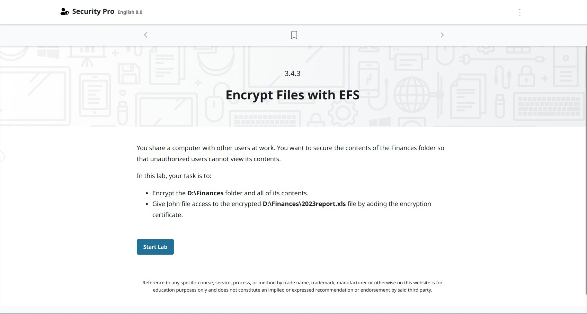

---

โจทย์ :  คุณใช้งานคอมพิวเตอร์เครื่องเดียวร่วมกับผู้ใช้คนอื่นในที่ทำงาน คุณต้องการป้องกันข้อมูลภายในโฟลเดอร์ Finances เพื่อไม่ให้ผู้ใช้ที่ไม่ได้รับอนุญาตสามารถดูข้อมูลภายในได้

ในแลปนี้ งานของคุณคือ:

เข้ารหัส (Encrypt) โฟลเดอร์ D:\Finances และไฟล์ทั้งหมดที่อยู่ภายใน
ให้ผู้ใช้ชื่อ John สามารถเข้าถึงไฟล์ D:\Finances\2023report.xls ที่ถูกเข้ารหัสได้ โดยการเพิ่ม ใบรับรองการเข้ารหัส (Encryption Certificate)

🔐 ขั้นตอนที่ 1: เข้ารหัสโฟลเดอร์ D:\Finances และไฟล์ทั้งหมด
---
---
โจทย์นี้เป็นการใช้ EFS (Encrypting File System) บน Windows เพื่อเข้ารหัสโฟลเดอร์ และเพิ่มสิทธิ์ให้ผู้ใช้อื่นเปิดไฟล์ที่เข้ารหัสได้
---

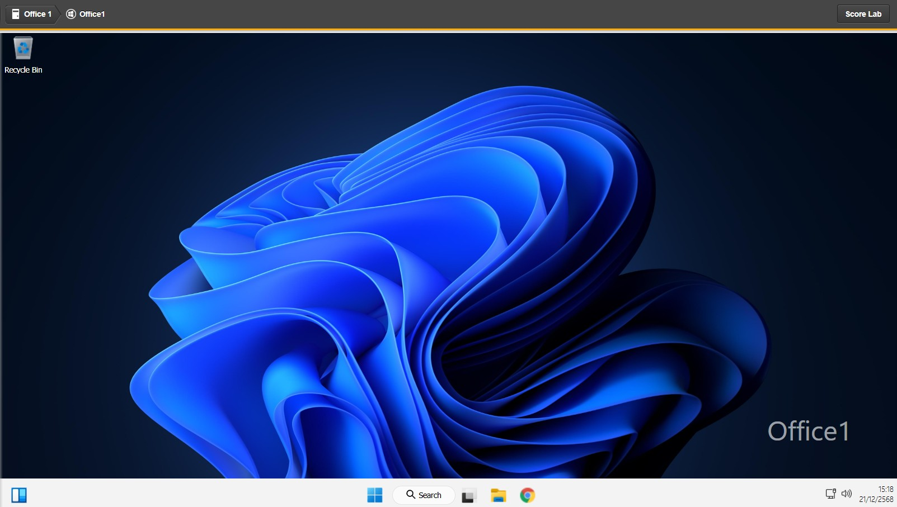

1. เปิด File Explorer

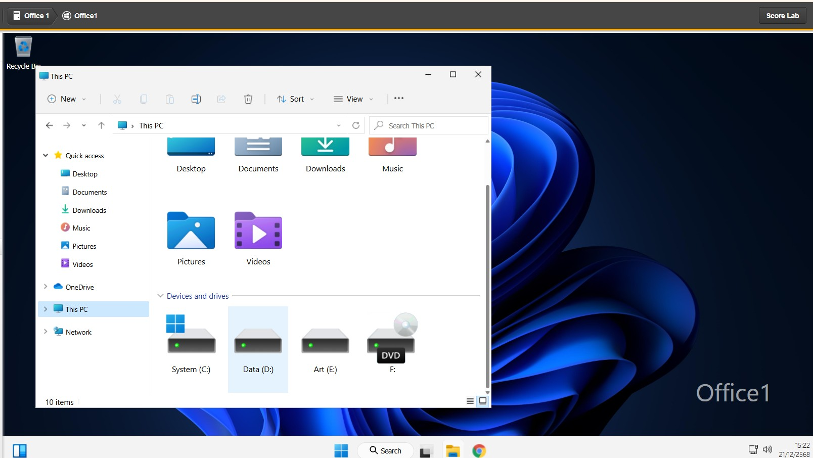
2. ไปที่ไดรฟ์ D:\

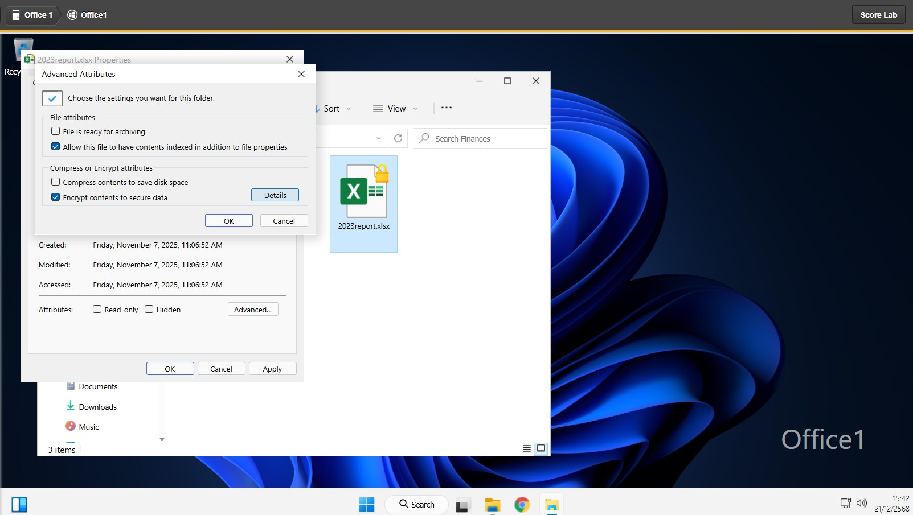
3. คลิกขวาที่โฟลเดอร์ Finances

4. เลือก Properties

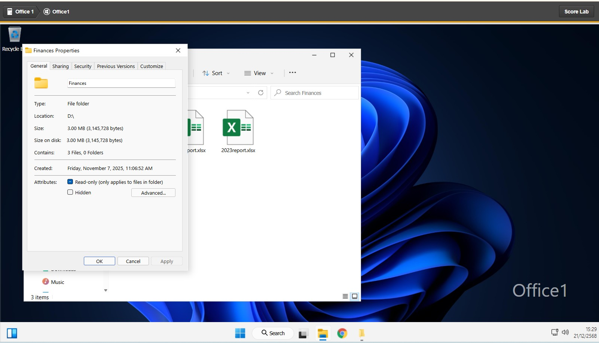
5. กดปุ่ม Advanced…

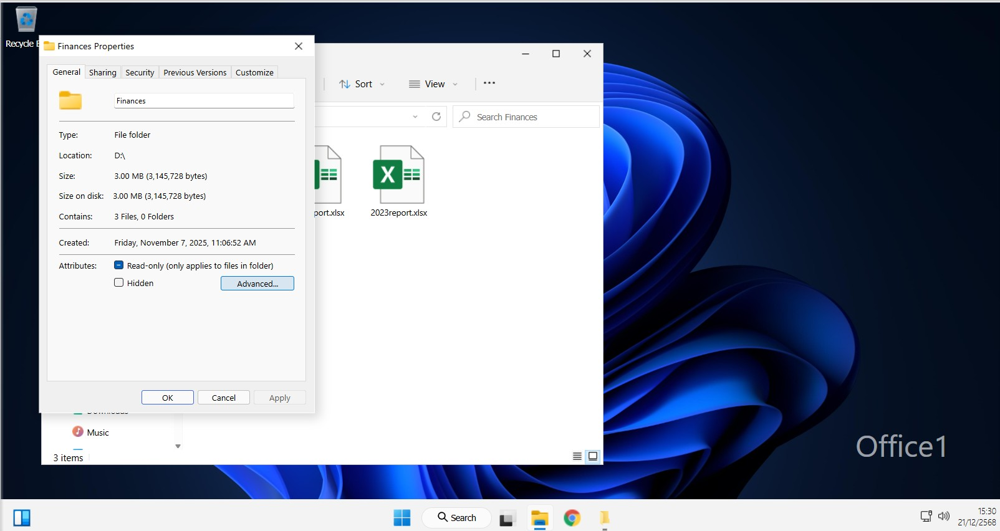
6. ติ๊ก ✔️ Encrypt contents to secure data

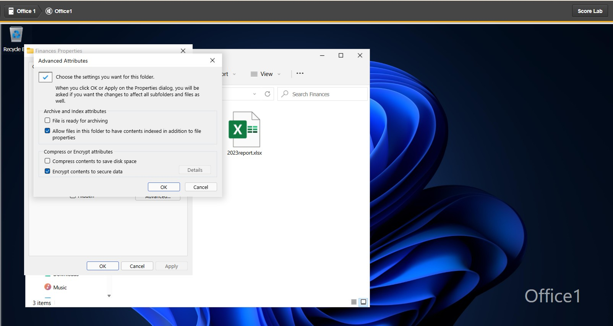
7. กด OK

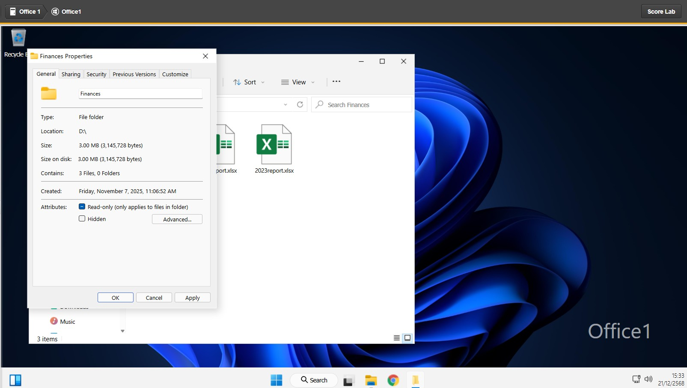
8. กด Apply

9. ระบบจะถาม ให้เลือก
👉 Apply changes to this folder, subfolders and files

10. กด OK 

✅ ตอนนี้โฟลเดอร์ D:\Finances และไฟล์ทั้งหมดถูกเข้ารหัสแล้ว
---

👤 ขั้นตอนที่ 2: ให้ John เปิดไฟล์ D:\Finances\2023report.xls ได้

ต้องเพิ่ม Encryption Certificate ของ John ให้กับไฟล์นี้

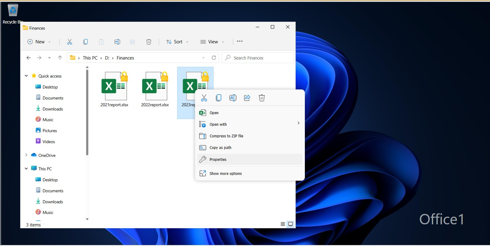
12. ไปที่ไฟล์ D:\Finances\2023report.xls
   
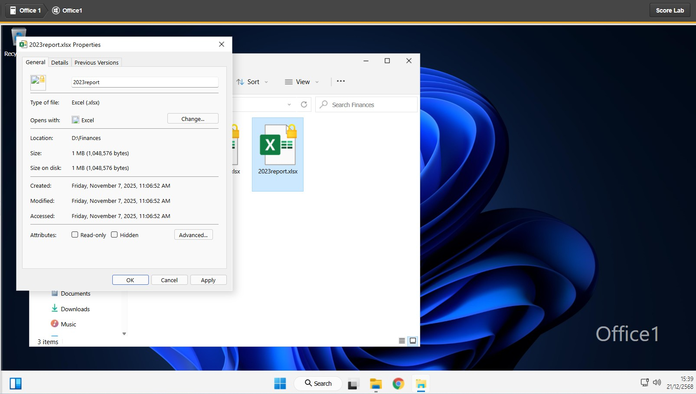
11. คลิกขวาที่ไฟล์ → Properties

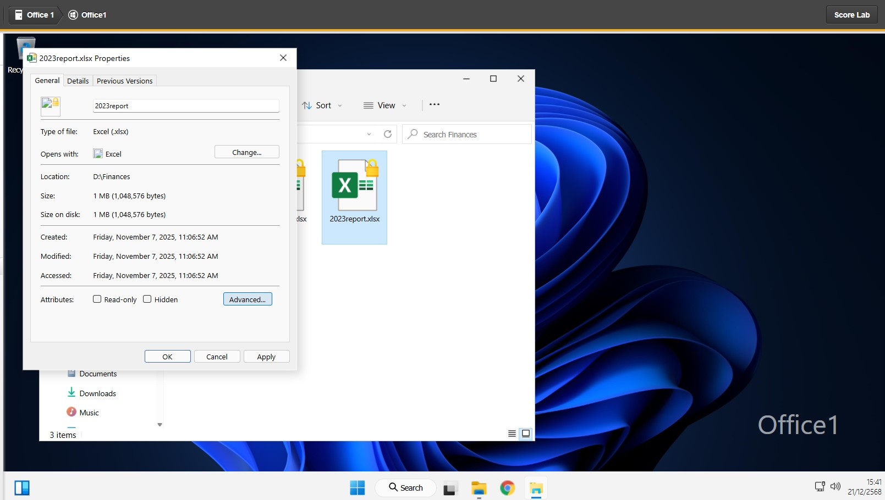
13. กด Advanced…

14. กดปุ่ม Details

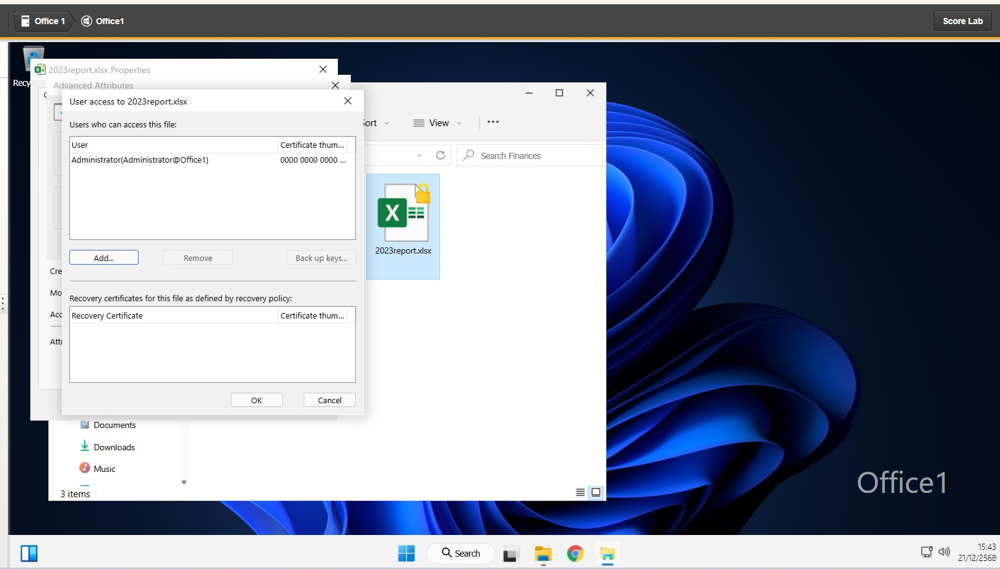
14. กด Add…

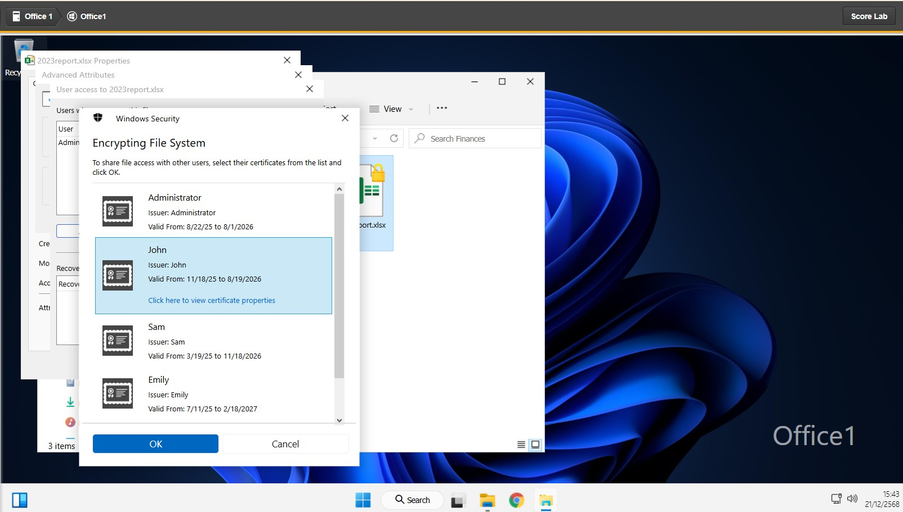
15. เลือกผู้ใช้ John

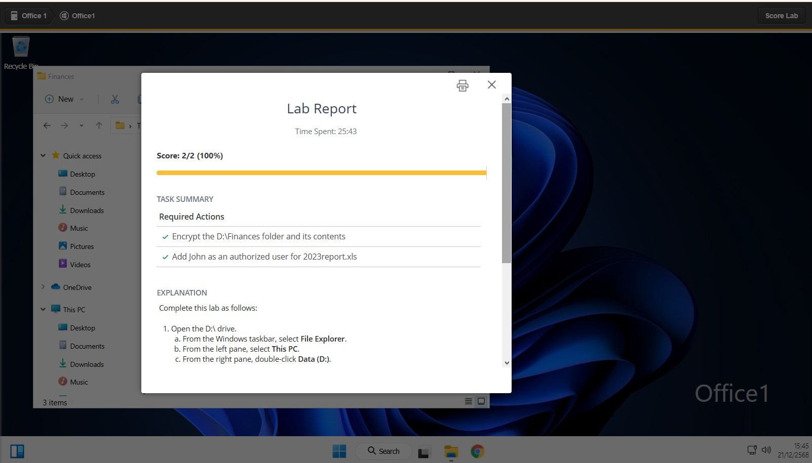
กด OK 

กด OK ทุกหน้าต่างจนปิดหมด
✅ ตอนนี้ John สามารถเปิดไฟล์ 2023report.xls ได้ แม้ไฟล์จะถูกเข้ารหัส

