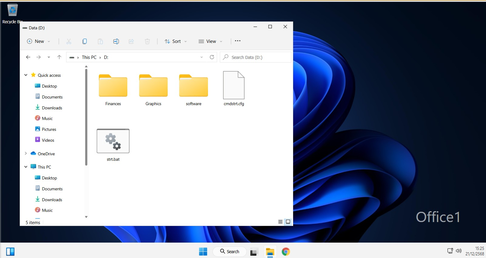

# Encrypt Files with EFS.md > 

---

โจทย์ :  คุณใช้งานคอมพิวเตอร์เครื่องเดียวร่วมกับผู้ใช้คนอื่นในที่ทำงาน คุณต้องการป้องกันข้อมูลภายในโฟลเดอร์ Finances เพื่อไม่ให้ผู้ใช้ที่ไม่ได้รับอนุญาตสามารถดูข้อมูลภายในได้

ในแลปนี้ งานของคุณคือ:

เข้ารหัส (Encrypt) โฟลเดอร์ D:\Finances และไฟล์ทั้งหมดที่อยู่ภายใน
ให้ผู้ใช้ชื่อ John สามารถเข้าถึงไฟล์ D:\Finances\2023report.xls ที่ถูกเข้ารหัสได้ โดยการเพิ่ม ใบรับรองการเข้ารหัส (Encryption Certificate)

---
โจทย์นี้เป็นการใช้ EFS (Encrypting File System) บน Windows เพื่อเข้ารหัสโฟลเดอร์ และเพิ่มสิทธิ์ให้ผู้ใช้อื่นเปิดไฟล์ที่เข้ารหัสได้
---

1. เปิด File Explorer

