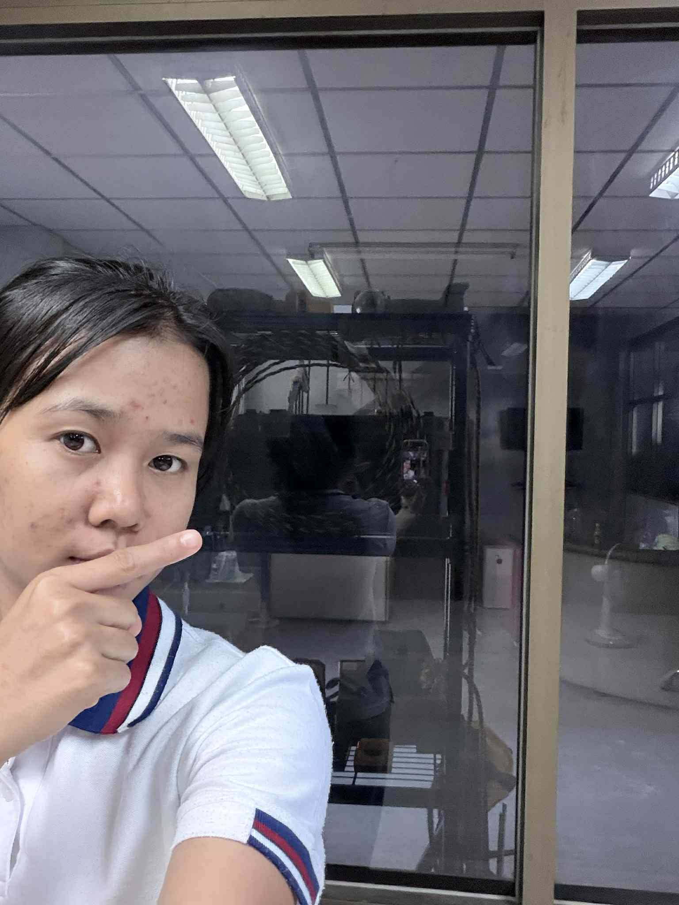

# กระจกติดฟิล์มทึบแสง

กระจกติดฟิล์มทึบแสงจัดเป็น **Physical Security Control**  
ที่มีลักษณะเป็น **Preventive Control (การควบคุมเชิงป้องกัน)**

---

## เหตุผลที่จัดเป็น Preventive Control

### 1. ป้องกันการมองเห็นจากภายนอก
- ลดโอกาสที่บุคคลภายนอกจะมองเห็นทรัพย์สิน  
- ป้องกันการเปิดเผยข้อมูลสำคัญภายในอาคาร  

### 2. ลดความเสี่ยงจากการสอดแนม (Visual Hacking)
- ป้องกันการแอบมองหน้าจอคอมพิวเตอร์  
- ลดความเสี่ยงจากการมองเห็นเอกสารสำคัญ  

### 3. เพิ่มความเป็นส่วนตัว
- ควบคุมการเปิดเผยข้อมูลหรือกิจกรรมภายในสถานที่  
- สร้างขอบเขตความเป็นส่วนตัวให้กับองค์กรหรือที่พักอาศัย  

### 4. เป็นมาตรการป้องกันก่อนเกิดเหตุ
- ลดความเสี่ยงตั้งแต่ต้นทาง  
- ป้องกันการโจรกรรมหรือการละเมิดข้อมูลก่อนที่จะเกิดขึ้น  

---

