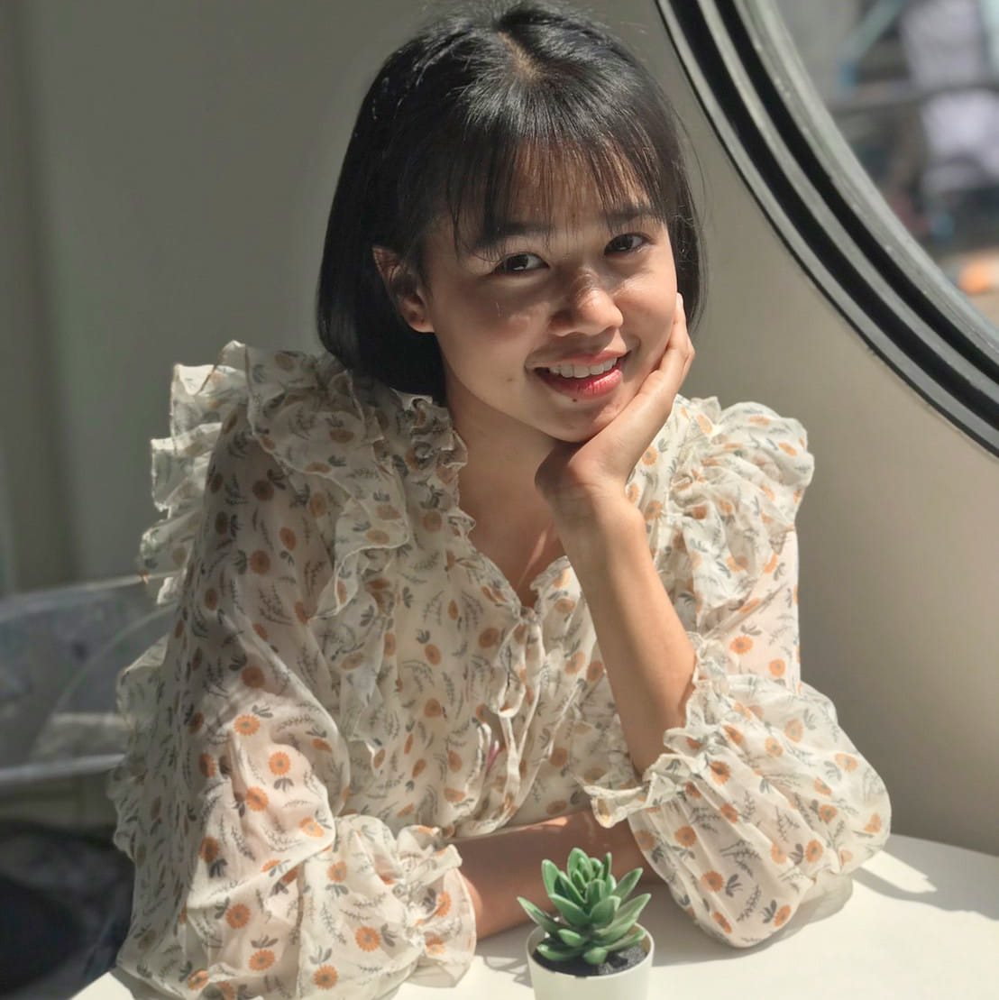
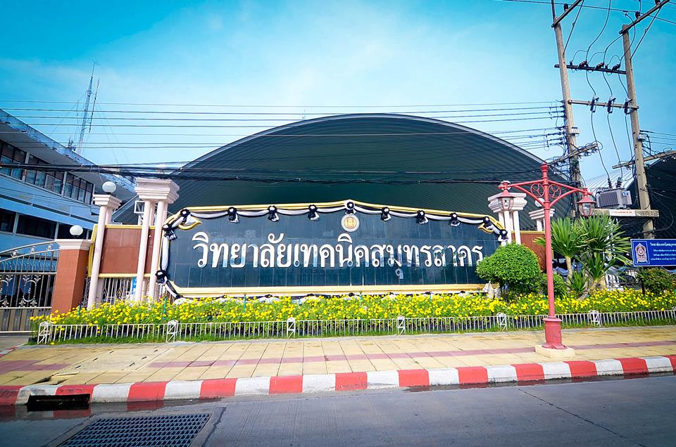

# boonmeemira.github.io >  
+ [BGP-speaker](BGP-speaker)
+ [CPU](CPU)
+ [Dig](Dig)
+ [Encrypt-Files-with-EFS](Encrypt-Files-with-EFS)

---

## Control Security Systems
+ [helmet](helmet.md)
+ [Time-clock-machine.md](Time-clock-machine.md)

---
## Git Wrapped 2025.
+ [Git-Wrapped-2025](Git-Wrapped-2025.md)

---

## 🎓 Education
> **Information Technology (ปี 4)**  
> Institute of Vocational Education : Central Region 5
>  
---

## 🧠 Skills
> - [Cybersecurity Fundamentals](/img/boonmee-Cybersecurity-Fundamentals-Cybersecurity-Fundamentals-APNIC-Academy.pdf)

---

## 📫 Contact
- Email: hhaeng33333@gmail.com  
- Facebook: [Mira Boonmee](https://web.facebook.com/mira123k/?locale=th_TH/)
  
---

## 🎉 Happy New Year 2026 🎆
> - [Happy-New-Year](Happy-New-Year.md)

---

## Gemini 
> - [Gemini-Faculty](https://boonmeemira.github.io/Gemini-Faculty.html)
> - [Gemini-Educator](https://boonmeemira.github.io/Gemini-Educator.html) 

---

##  PDPA
 🔑 [PDPA](PDPA.md)
 
---

## Zero Trust
 - [Zero-Trust.mdr](Networks.md)
 
