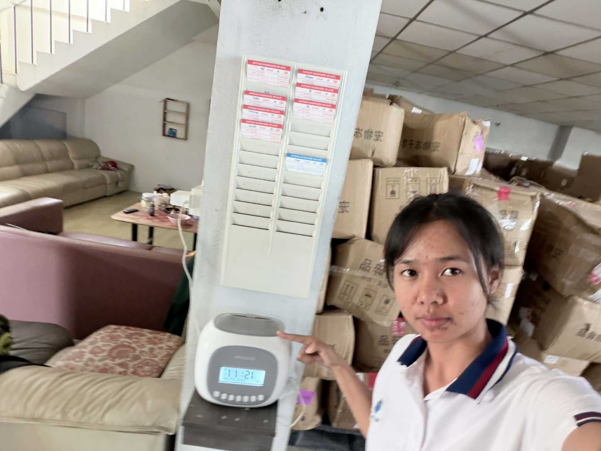

# 👆 เครื่องตอกบัตร

---
## ❓ เหตุผลที่จัดเป็น Preventive Control

### 1) Security Control Function (หน้าที่ของการควบคุม)
⭐ Detective Control — หน้าที่หลัก (Primary Function)

- ระบบเครื่องตอกบัตรมีหน้าที่หลักคือ “ตรวจจับ” และบันทึกเวลาทำงานอย่างถูกต้อง เช่น

- ตรวจพบการมาสาย ออกก่อนเวลา

- ตรวจพบ OT ผิดปกติ

- ตรวจพบพฤติกรรมเสี่ยง เช่น ลงเวลาแทนกัน

- ข้อมูลที่บันทึกช่วยให้ HR ตรวจสอบย้อนหลังได้

➡ จึงจัดให้ Detective เป็นหน้าที่หลักที่สุด

---

### 🛡 Preventive Control — หน้าที่รอง (Secondary Function)

ขึ้นอยู่กับเทคโนโลยีที่ใช้ (RFID, Fingerprint, Face Scan) เช่น

ป้องกันการลงเวลางานแทนบุคคลอื่น

ป้องกันบุคคลไม่มีสิทธิ์เข้าพื้นที่ (จุดวางเครื่องอยู่หน้าประตู)

ลดความผิดพลาดของข้อมูลจาก Human Error เพราะบันทึกอัตโนมัติ

➡ เป็นการป้องกัน “ก่อน” เกิดเหตุ แต่ ไม่ใช่งานหลัก

---

🚫 Deterrent Control — หน้าที่รอง

ทำให้พนักงานรู้ว่ามีการตรวจสอบ

ยับยั้งการทุจริต เช่น Buddy Punching

ลดความตั้งใจในการโกงเวลา เพราะรู้ว่าระบบมีหลักฐานเก็บไว้

➡ ทำหน้าที่ยับยั้ง (ไม่ใช่ป้องกันโดยตรง)

---

📌 สรุปหน้าที่การควบคุม (Function Summary)
⭐ Function	     ⭐ บทบาท
- Detective	      - หลัก: ตรวจจับและบันทึกพฤติกรรมผิดปกติ
- Preventive	    -  รอง: ป้องกันปลอมแปลง/เข้าสถานที่
- Deterrent	      -  รอง: ป้องปรามไม่ให้ทุจริตเวลา

---

2) Type of Control (ประเภทของการควบคุม)
🧑‍💼 Administrative Control

- เกี่ยวข้องกับนโยบาย HR เช่น เวลาทำงาน การลงเวลา

- ใช้เป็นหลักฐานการบริหารบุคลากร

- บังคับให้พนักงานต้องปฏิบัติตามขั้นตอน

---

💻 Technical Control (เมื่อเป็นระบบอิเล็กทรอนิกส์)

- ใช้ RFID, Fingerprint, Face recognition

- เก็บข้อมูลแบบอัตโนมัติ

- เชื่อมต่อกับระบบ HR / IAM

- ยืนยันตัวตน (Authentication) ป้องกันการปลอมแปลง

---

🏢 Physical Control

- ควบคุมการเข้า-ออกสถานที่ผ่านจุดติดตั้งเครื่อง

- เครื่องอยู่ทางเข้าพื้นที่ทำงาน → ช่วยป้องกันบุคคลภายนอก

📌 สรุปประเภท Control (Type Summary)
- ⭐ประเภท	
- Administrative	
- Technical	
- Physical	

- ⭐รายละเอียด
- นโยบาย/ขั้นตอนของ HR, หลักฐานการทำงาน
- ระบบสแกน, RFID, biometric, ระบบบันทึกอัตโนมัติ
- ควบคุมจุดผ่านเข้า-ออก

🎯 สรุปภาพรวมแบบสั้น (ใช้ตอบข้อสอบ/ส่งงานได้เลย)

- เครื่องตอกบัตร/สแกนนิ้วเป็นระบบที่มีหน้าที่หลักคือ Detective Control
- ใช้บันทึกและตรวจจับเวลาทำงาน รวมถึงตรวจพบพฤติกรรมผิดปกติ เช่น มาสาย ลงเวลาแทนกัน

- หน้าที่รองคือ Preventive + Deterrent
- ช่วยป้องกันปลอมแปลงเวลา ป้องกันบุคคลไม่พึงประสงค์ และยับยั้งพฤติกรรมทุจริต

- เป็นทั้ง Administrative, Technical และ Physical Control
- เพราะเกี่ยวข้องกับนโยบาย HR มีเทคโนโลยียืนยันตัวตน และติดตั้งที่ทางเข้าอาคาร
