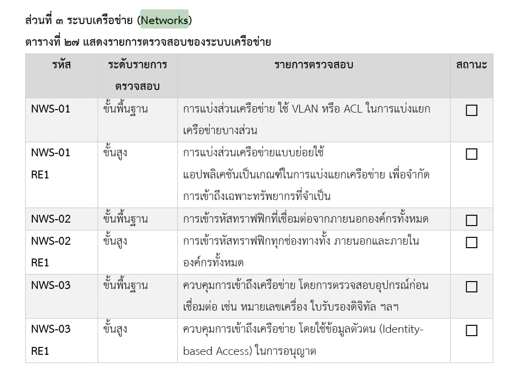

## 3️⃣ Networks

*ตัวอย่างที่หนูใช้ในชีวิตประจำวันคือ*  
การเชื่อมต่อ เช่น อินเทอร์เน็ตหรือเครือข่ายองค์กร

*ในชีวิตประจำวัน:*  
- Wi-Fi บริษัท

### 📌 รูปตัวอย่างการใช้อินเทอร์เน็ตหรือเครือข่ายองค์กร

---
