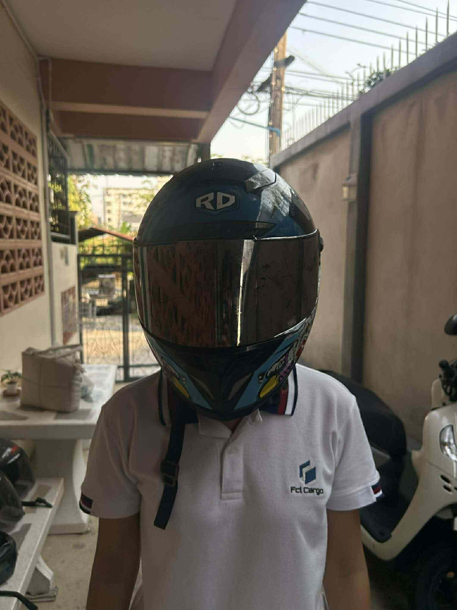

# หมวกกันน็อก (Helmet)

หมวกกันน็อกจัดเป็น **Physical Security Control**  
ที่มีลักษณะเป็น **Preventive Control**

> ❗ ไม่ใช่ Technical Security Control  
> เพราะไม่ใช่เทคโนโลยีด้านระบบหรือไอที แต่เป็นอุปกรณ์ป้องกันทางกายภาพ

---

## เหตุผลที่เป็น Preventive Control

- ป้องกันการบาดเจ็บที่ศีรษะ  
- ลดความรุนแรงจากอุบัติเหตุทางรถจักรยานยนต์  
- ลดความเสี่ยงก่อนเกิดความเสียหายร้ายแรง  
- สวมใส่ไว้ล่วงหน้าเพื่อป้องกันผลกระทบ  
- เป็นมาตรการป้องกันเชิงกายภาพ (Physical Protection)  
- ทำหน้าที่เป็นเกราะป้องกันแรงกระแทก  
- ช่วยลดอัตราการเสียชีวิตและการบาดเจ็บรุนแรง  
- ทำหน้าที่ควบคุมความเสี่ยงตั้งแต่ก่อนเกิดเหตุ  

---

